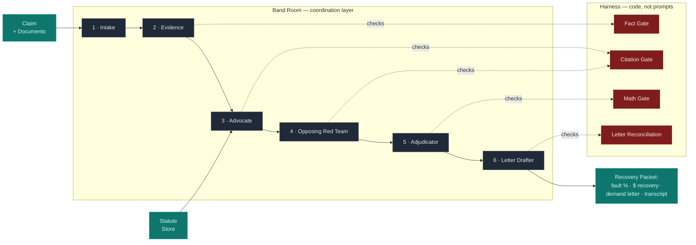
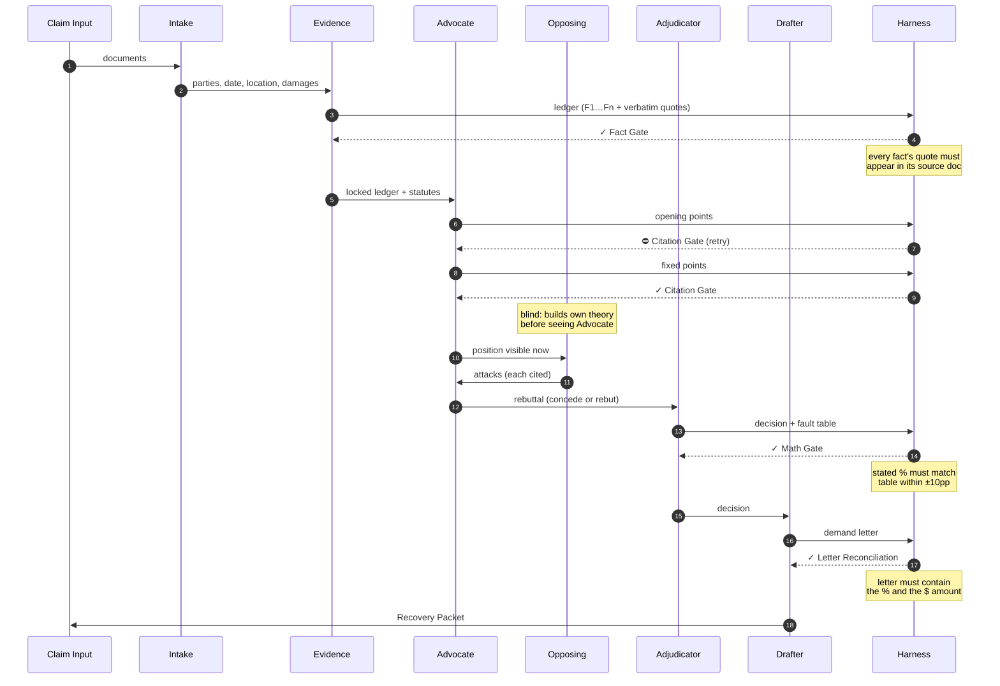
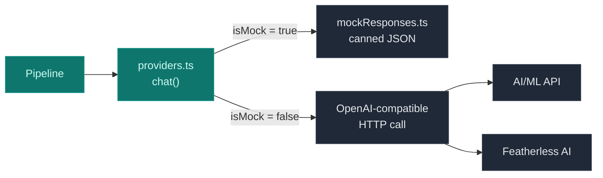

# Lumen — Architecture

A 5-minute read for anyone opening the codebase. For *what* this project is and *why*, see [`README.md`](./README.md) and [`plan.md`](./plan.md). This document explains *how it's built*.

---

## System Overview

A claim and its documents enter the system on the left. Six specialized agents coordinate through a shared room. A separate **Harness** layer of code-enforced gates watches the agents and rejects work that violates the rules. A Recovery Packet comes out the other side.



Two ideas to anchor on:

1. **The Room is where agents talk.** It's an ordered transcript with a subscription callback. In the current code it's an in-memory stand-in (`src/room.ts`); when the Band SDK is wired in, this is the single swap point.
2. **The Harness watches the Room.** Each gate is plain code — not a prompt — and runs at a specific point in the pipeline. Agents cannot bypass them; the LLM can't outsmart `Set.has()` or arithmetic.

---

## Pipeline Sequence

The 6 agents fire in a fixed order. The Harness intercepts at four moments. There is intentionally **no consensus round** — debate closes, then a separate neutral agent decides.



---

## The Harness — Four Code-Enforced Gates

The harness is the most important architectural decision in the project. It defends against the two failure modes that destroy multi-agent systems: **hallucination** (agents inventing facts) and **collusion** (agents drifting toward false agreement).

| Gate | What it checks | Where | Catches |
|---|---|---|---|
| **Fact Gate** | Every ledger fact's `verbatimQuote` must be a contiguous substring of its source document | `src/factGate.ts` | Evidence agent mis-extracting facts, swapping parties, or hallucinating sources |
| **Citation Gate** | Every argument point must have ≥1 citation, and every citation must resolve to a known fact ID or statute ID | `src/citationGate.ts` | Advocate/Opposing inventing citations or arguing without evidence |
| **Math Gate** | Adjudicator's stated fault % must follow from its own fault table (within ±10pp tolerance) | `src/mathGate.ts` | Adjudicator's table and percentage drifting apart (LLMs are bad at arithmetic) |
| **Letter Reconciliation** | Final demand letter must contain the decided fault % and recovery $ amount | `src/pipeline.ts` (inline) | Drafter producing a letter that contradicts the dashboard |

Gates that fail produce a visible posting in the room. Citation Gate failures trigger a retry with the violation injected back into the prompt. Math/Letter failures force escalation.

---

## Anti-Collusion Mechanisms (Not Gates, but Structural)

These don't have a single file — they're properties of the pipeline:

- **Independent drafts.** Opposing builds its own theory *before* seeing Advocate's points (`pipeline.ts` step 4). No anchoring.
- **Different model families per side.** Advocate on Claude family, Opposing on GPT family (`config.ts`). Resists sycophantic convergence.
- **Red team prompt.** Opposing is forbidden from negotiating or seeking agreement (`prompts.ts:OPPOSING_PROMPT`).
- **No consensus round.** The pipeline ends debate after rebuttal. There is no "find common ground" turn anywhere in the code.
- **Separation of powers.** Debaters do not decide. A separate Adjudicator agent reads the transcript and computes fault.
- **Escalation triggers.** Recovery ≥ $25K, confidence < 0.6, fault near 50/50, or any gate violation → human approval required.

---

## Agents & Provider Routing

Each agent runs on the model best suited for its job. The provider mix is deliberate: **frontier models for judgment, OSS models for high-volume mechanical work** — also the architecture story for both partner prizes.

| # | Agent | File | Provider | Model (placeholder) | Job |
|---|---|---|---|---|---|
| 1 | Intake Parser | `agents.ts` | Featherless (OSS) | `Llama-3.1-8B-Instruct` | Extract parties, date, location, damages |
| 2 | Evidence Aggregator | `agents.ts` | Featherless (OSS) | `Qwen2.5-72B-Instruct` | Build the Evidence Ledger from documents |
| 3 | Liability Advocate | `agents.ts` | AI/ML API (frontier) | `claude-3-opus` | Argue our insured is owed recovery |
| 4 | Opposing Red Team | `agents.ts` | AI/ML API (frontier) | `gpt-4o` | Attack our case (never negotiates) |
| 5 | Adjudicator | `agents.ts` | AI/ML API (frontier) | `claude-3-5-sonnet` | Neutrally weigh evidence → fault % |
| 6 | Demand Letter Drafter | `agents.ts` | AI/ML API (frontier) | `claude-3-5-sonnet` | Compose the formal demand letter |

Model IDs are placeholders defined in `src/config.ts:MODELS` — confirm exact catalog IDs before flipping to live mode.

---

## The Evidence Ledger (the central data structure)

Everything in this system orbits one shape: an atomic, cited, source-anchored list of facts. The Evidence agent produces it once; every downstream agent argues *only* over it.

```typescript
// src/types.ts
{
  caseId: "CLM-2026-0427",
  facts: [
    {
      id: "F1",                                                  // referenced as [F1]
      statement: "Driver B entered against a steady red light.",  // paraphrase
      source: "police_report.pdf",                                // doc filename
      verbatimQuote: "Vehicle 2 (Blake) entered the intersection against a steady red signal",
      confidence: 0.9
    },
    // ...
  ]
}
```

The `verbatimQuote` field is what the **Fact Gate** verifies. The `id` field is what the **Citation Gate** validates against. Together they make the ledger a real foundation rather than an LLM summary.

---

## Code Map

```
src/
├── config.ts          Providers, model IDs, ESCALATE_USD threshold
├── types.ts           Zod schemas — Fact, Ledger, Point, Rebuttal, Decision
├── providers.ts       OpenAI-compatible client + auto mock switch
├── mockResponses.ts   Deterministic canned outputs for offline runs
├── ledger.ts          validCitationIds() + ledger/statute rendering
├── citationGate.ts    Code gate #1 — points must cite known IDs
├── factGate.ts        Code gate #2 — facts must anchor to verbatim source text
├── mathGate.ts        Code gate #3 — adjudicator math must hold
├── prompts.ts         System prompts (anti-hallucination rules baked in)
├── agents.ts          AgentDef objects (role, provider, model, color)
├── room.ts            Band-room stand-in (post() + onPost subscription)
├── pipeline.ts        The structured debate + adjudication + Letter Recon
└── runDemo.ts         CLI entry point with colored transcript
data/
├── sample_claim_clean.json    One clean-win case (CA, $42K, red light)
└── statutes.json              Verbatim statute text (CA-1431.2, CVC-21453)
```

The whole system is **deliberately small** (≈600 lines TypeScript). Readability is the goal — judges should be able to point at any decision in the demo and see it in the code.

---

## Mock vs Live Mode

The pipeline is **identical** in both modes; only the model client changes. This is the single most important property for hackathon demos — the recorded video can run on mock with zero risk of API flakes, while live mode validates against real models.



Mock is the default when no API keys are set. Override with `LUMEN_MOCK=1` (force mock) or `LUMEN_MOCK=0` (force live, requires keys in `.env`).

---

## Band SDK Swap Point

There is **exactly one file** to change when the real Band SDK is wired in: `src/room.ts`.

```typescript
// Today: in-memory stand-in
post(agent, color, kind, content): Posting { /* push to local array */ }

// With Band SDK: same signature
post(agent, color, kind, content): Posting {
  return bandRoom.sendMessage({ agent, kind, content });
}
```

Everything else — the pipeline, the gates, the prompts, the agents — is Band-agnostic. The gates and turn protocol become Band room rules; the rest is unchanged.

---

## Extending the System

To add a new agent (e.g., the stretch "Source-Alignment Verifier"):

1. Add the system prompt to `src/prompts.ts`
2. Add an `AgentDef` to `src/agents.ts` with provider + model
3. Add a mock response in `src/mockResponses.ts` keyed by `mockKey`
4. Add the call in the right place in `src/pipeline.ts`
5. If it produces structured output, add a zod schema in `src/types.ts`

To add a new gate:

1. Create `src/<name>Gate.ts` exporting a pure `check(...)` function
2. Call it in `src/pipeline.ts` at the right point
3. Post the result to the room with `'gate'` kind (`runDemo.ts` renders ✓/⛔ automatically)

To add a new test case:

1. Drop a JSON file in `data/` matching the `ClaimInput` shape
2. Add matching mock responses to `mockResponses.ts` (keyed off the pipeline's `mockKey` values)
3. Update `runDemo.ts` to load it (or accept a CLI arg)

---

## What This Architecture Is Not Trying To Be

To prevent scope creep, three explicit non-goals:

- **Not an autonomous filing system.** A human always signs off on demand letters; the system produces first drafts.
- **Not a general-purpose multi-agent framework.** This is one workflow done well. Generality would dilute the demo.
- **Not infrastructure for Band itself.** We use Band as a coordination layer; we don't extend its primitives.
