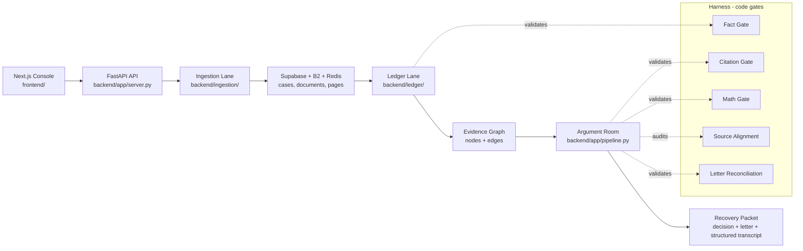
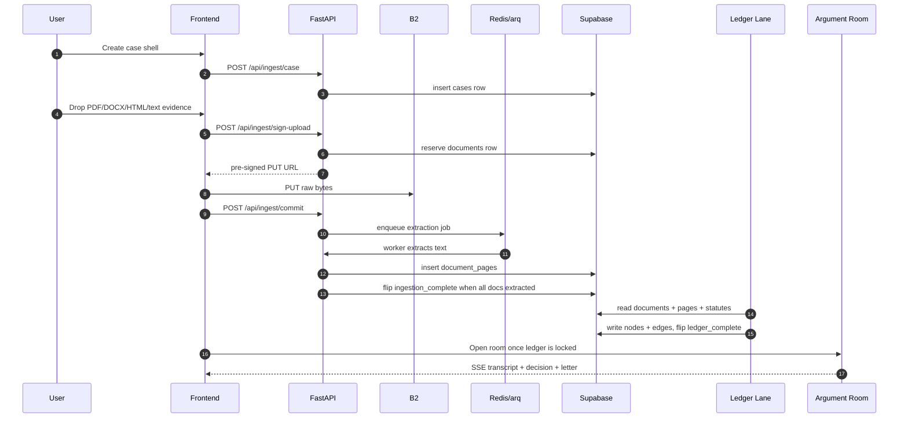

# Lumen Architecture

This document explains how the current repository is wired. For the product story, read [Product Context](./product-context.md). For the documentation map, read [Documentation Map](./README.md).

## System Overview

Lumen is now split into three production lanes plus a frontend console:



The production backend is Python under `backend/`. The root `src/` and `server/` folders are retained as the legacy offline TypeScript demo and should not drive production decisions.

## Case Sources

The frontend shows two case sources through the same API surface:

| Source | IDs | Backing store | Main use |
|---|---|---|---|
| Demo cases | `clean`, `loser` | `data/cases.json` + sample JSON claims | Deterministic mock debate and judge demo |
| Real cases | Supabase UUIDs | `cases`, `documents`, `document_pages`, `nodes`, `edges` | Uploaded evidence and staged production workflow |

`GET /api/cases` returns both demo cases and Supabase cases. `GET /api/case/{id}` dispatches by ID shape: demo IDs return the legacy `{meta, claim}` shape, while UUIDs return `{case, documents, has_ledger, nodes, edges}` for the staged case-detail UI.

The ledger handoff is wired: when ingestion flips `ingestion_complete=true`, the winning worker enqueues the arq job `run_ledger_build`, which reads the case's documents/pages/statutes, builds the typed graph, writes `nodes`/`edges` via asyncpg, and flips `ledger_complete=true` (see `backend/ledger/service.py`, `db_repository.py`, `jobs.py`). That opens the Argument Room in the UI.

`GET /api/run/{case_id}` runs the courtroom hearing for **both** sources. Demo ids (`clean`/`loser`) build their ledger from the bundled claim and stream in-memory. Real UUIDs run the hearing **over the persisted graph**: `backend/ledger/service.py::load_run_inputs` reconstructs the claim from `documents`/`document_pages`, loads statutes, and projects the stored Fact `nodes` into an `EvidenceLedger`; `run_lumen(..., ledger=...)` then skips the rebuild and argues over those facts. The server requires `ledger_complete=true` (returns 409 otherwise). On the UUID path, orchestration inserts a `runs` row, persists every room posting plus structured metadata to `transcript`, inserts the final `decisions` row, rolls up decision outcome and `last_run_at` onto the case record, returns `runId`, and exposes replay/history through `GET /api/cases/{case_id}/runs` and `GET /api/runs/{run_id}/transcript`. Human approval persistence and flipping `cases.finalized` remain follow-ups.

## Production Flow



The handoff flags on `cases` are the lane contract:

| Flag | Set by | Opens |
|---|---|---|
| `ingestion_complete` | Ingestion worker or manual finalize endpoint | Ledger graph build |
| `ledger_complete` | Ledger repository after nodes and edges persist | Argument Room |
| `finalized` | Future human approval persistence | Closed recovery packet |

## Courtroom Orchestration

The orchestration lane is now a bounded courtroom protocol, not an open-ended agent chat. `backend/app/courtroom.py` deterministically creates a docket from the locked ledger: primary liability, comparative fault, damages, and legal basis. `backend/app/orchestration_tools.py` exposes clerk-side, read-only ledger/statute lookup helpers for the current run. Agents do not get raw shell access or model-native tools yet.

The live sequence in `backend/app/pipeline.py` is:

1. Court Clerk opens the claim and locks the ledger.
2. Court Clerk posts the issue docket and compact issue packets.
3. Recovery counsel and defense counsel give independent opening briefs.
4. For the liability and comparative-fault packets, defense cross-examines and recovery counsel redirects.
5. Neutral adjudicators decide independently, then Math and Consensus gates run.
6. Source Alignment verifies cited claims.
7. Viability, demand drafting, and Letter Reconciliation finish the packet.

Every room posting can carry metadata: phase, actor key, issue key/title, turn type, target actor, citations, gate verdict, and tool summary. The frontend uses this metadata for courtroom labels and replay while preserving the old flat transcript text for readability.

## Agents And Gates

The orchestration lane still uses the specialist team in `backend/app/`:

| Agent | File | Role |
|---|---|---|
| Intake Parser | `backend/app/agents.py` | Extracts incident facts |
| Evidence Aggregator | `backend/app/agents.py` | Builds the evidence ledger in demo fallback mode |
| Liability Advocate | `backend/app/agents.py` | Argues for recovery |
| Opposing-Carrier Red Team | `backend/app/agents.py` | Attacks the recovery case |
| Adjudicator A | `backend/app/agents.py` | Primary neutral fault decision |
| Adjudicator B | `backend/app/agents.py` | Independent cross-family decision |
| Source-Alignment Verifier | `backend/app/agents.py` | Audits cited claims against source facts |
| Demand Letter Drafter | `backend/app/agents.py` | Writes the demand package |

Model-family defaults live in `backend/app/config.py` and are environment-overridable. Active defaults use OpenAI + Anthropic; Gemini remains configurable but is not part of the current assignment unless an agent is explicitly reassigned. Treat model values as configuration defaults only; confirm provider catalog IDs before live runs.

The code gates are in `backend/app/gates.py` plus the letter reconciliation check in `backend/app/pipeline.py`:

| Gate | What it checks | Failure behavior |
|---|---|---|
| Fact Gate | Ledger facts quote exact source text | Records the failure and forces human review if the run continues |
| Citation Gate | Argument points cite packet-scoped fact IDs or statute IDs | Retries with visible room warning; unresolved failures force human review |
| Math Gate | Fault percentage matches the adjudicator table within tolerance | Excludes bad adjudicator output and escalates |
| Source Alignment | Verifier labels cited claims as supported or contradicted | Contradictions feed escalation |
| Letter Reconciliation | Letter contains the decided fault percentage and recovery amount | Forces escalation if the packet contradicts the decision |

## Evidence Ledger

The durable ledger is a typed graph:

- `nodes` store facts, parties, vehicles, events, locations, statutes, damages, and documents.
- `edges` store relationships such as `mentioned_in`, `corroborates`, `contradicts`, `attributed_to`, and `governed_by`.
- Fact nodes must carry `verbatim_quote`, `source_document_id`, and `source_page_number`.

The debate lane consumes an `EvidenceLedger` projection of the graph. The projection is created by `backend/ledger/builder.py` through `graph_to_evidence_ledger(graph)`.

## Mock And Live Modes

Mock mode remains the safe default. With no provider keys, `backend/app/providers.py` uses deterministic responses from `backend/app/mock_responses.py`. Live mode is enabled by setting `LUMEN_MOCK=0` and provider keys in `.env` or `backend/.env`.

The Python CLI demo is the canonical no-infra check:

```bash
python -m backend.app.run_demo
```

The legacy TypeScript demo remains available through `pnpm demo`, but it should not be fixed unless a request explicitly targets the legacy path.

## Band Room Seam

The active Band seam is `backend/app/room.py`:

- `LocalRoom` is the in-memory mock room.
- `BandRoom` is the real SDK-backed mirror for agent messages.
- `make_room()` selects the implementation based on `LUMEN_BAND`.

Pipeline code posts through the same room interface in both modes, so the harness and agent sequencing remain Band-agnostic. The database `transcript` table, not Band, is the authoritative replay and audit store.

## Code Map

```text
backend/
  app/          FastAPI server, room, agents, providers, gates, pipeline
  ingestion/    Upload signing, B2 storage, async extraction queue, extractors
  ledger/       Typed graph builder, mock graphs, Supabase persistence seam
  schemas/      Pydantic row models mirroring database tables
  db/           Supabase SQL migrations and schema notes
frontend/
  app/          Next.js routes: cases list, new case chat intake, case detail
  components/   Documents, ledger graph, room, decision, gate panels
  lib/          Typed API client, upload helper, SSE stream hook, shared types
src/
  Legacy TypeScript demo only
server/
  Legacy Express server only
data/
  Demo case registry, sample claims, statute fixtures
```

## Extending The System

To add an ingestion format, add an extractor in `backend/ingestion/extractors/`, register its MIME type in `registry.py`, and mirror the supported type in the frontend upload validation.

To add a graph concept, update the SQL check constraint, the matching Pydantic schema in `backend/schemas/`, the frontend `NodeType` or `EdgeType`, and the ledger builder.

To add or change an agent, update `backend/app/prompts.py`, `backend/app/agents.py`, mock responses, and the structured output model in `backend/app/types.py` if the shape changes.

To add a new gate, keep it as plain code, wire it into `backend/app/pipeline.py`, and post the result to the room so the UI transcript shows the enforcement point.

## Non-Goals

- No autonomous filing or sending demand letters without human review.
- No generic multi-agent framework. Lumen is one recovery workflow.
- No scanned-PDF OCR, image vision, audio transcription, or spreadsheet ingestion in v1.
- No legacy TypeScript cleanup unless the legacy demo itself is the target.
