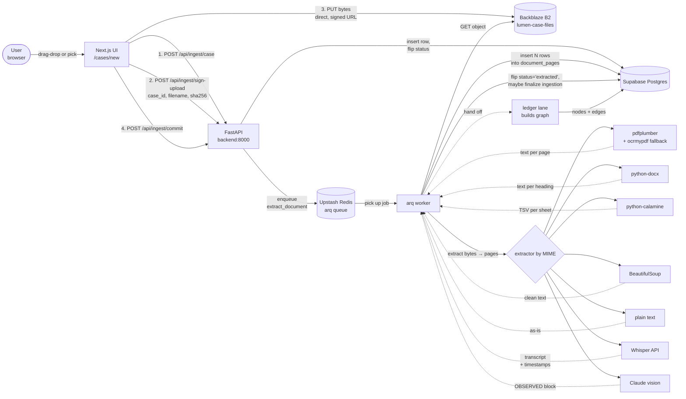
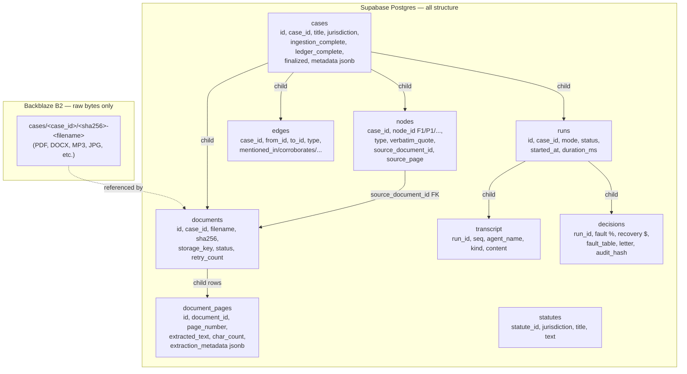
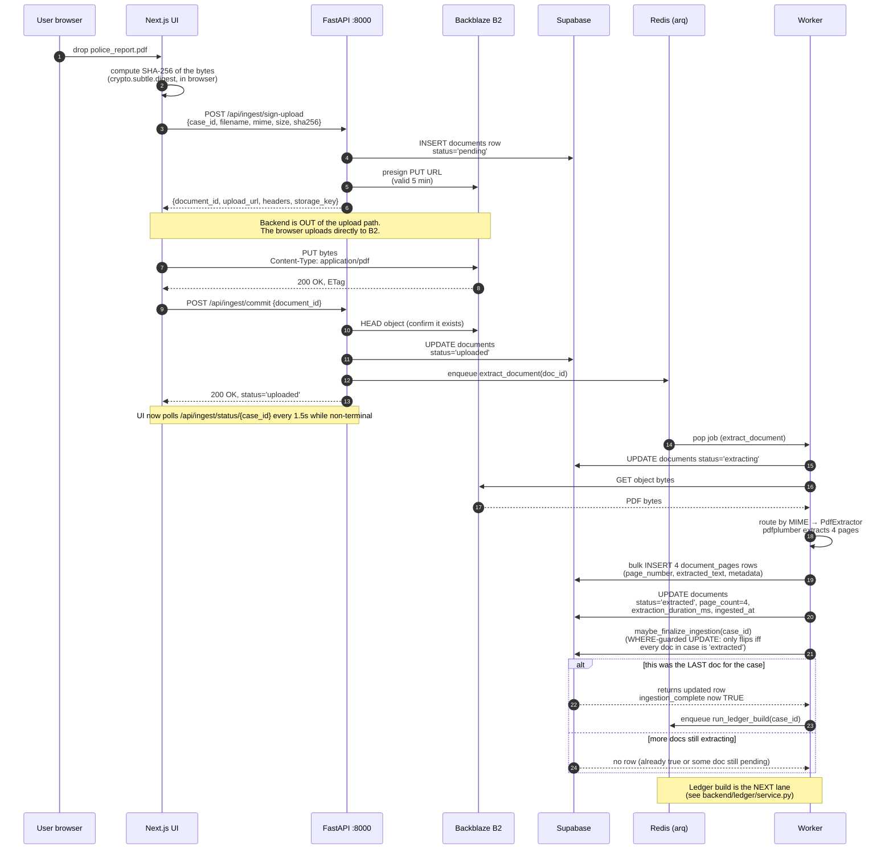
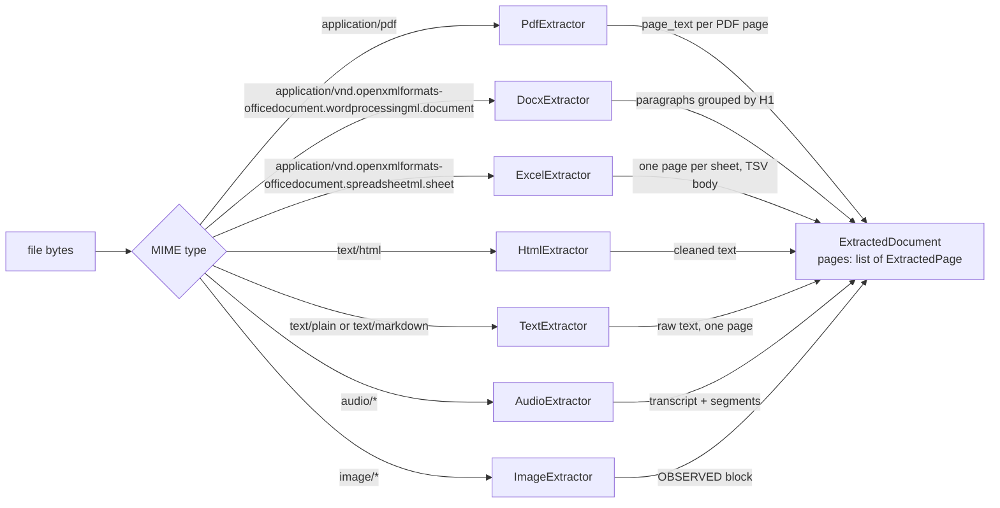
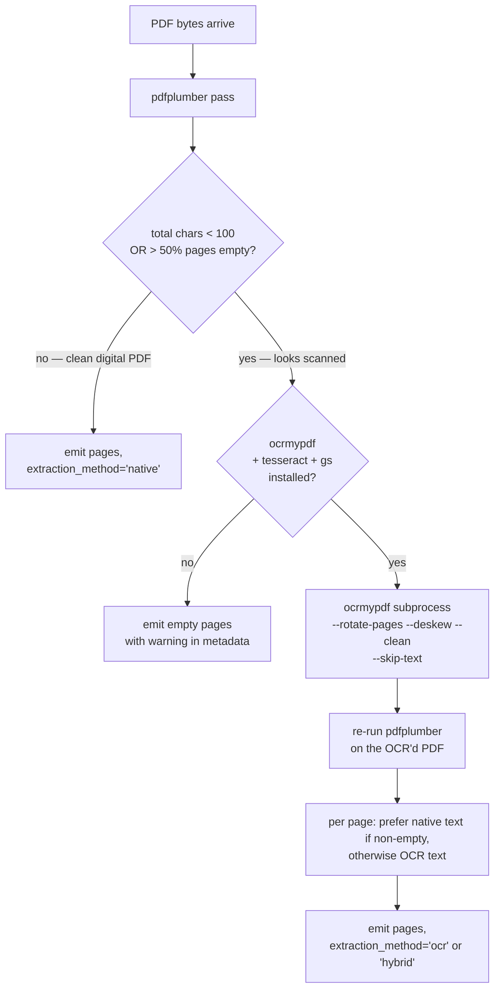
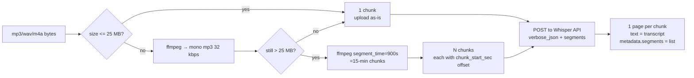
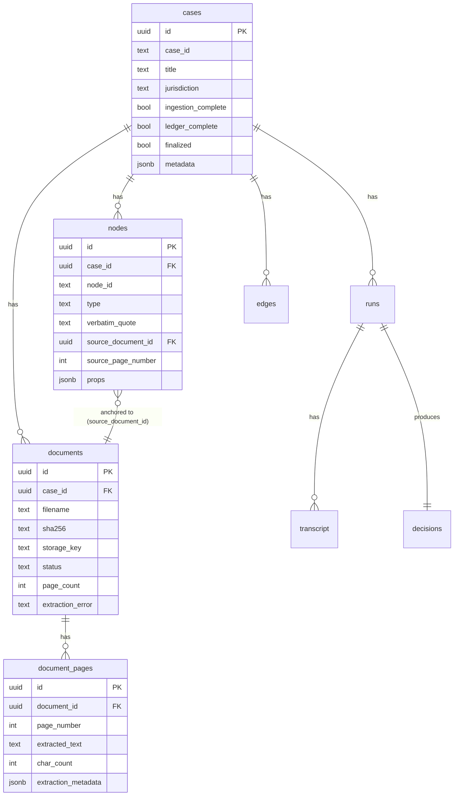
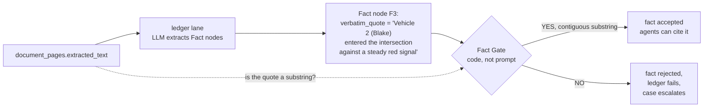
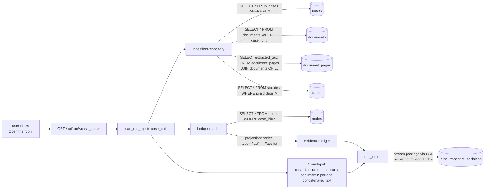

# Lumen — Ingestion Pipeline: End-to-End

> A plain-English walkthrough of what happens when a user uploads a file to Lumen,
> where the bytes go, how they become text, where that text is stored, and how
> the orchestration eventually reads it back to argue a subrogation case.
>
> If you remember nothing else: **raw bytes live in Backblaze B2, derived text
> lives in Supabase Postgres, and every Fact the agents cite later must be a
> contiguous substring of text we stored deterministically.**

---

## 1. The big picture in one diagram



That's everything. The rest of this document zooms in on each piece.

---

## 2. Where things live

Two storage systems, with **deliberate** separation:



**Plain-English rule:** Backblaze is the file cabinet — the original document
exactly as the user uploaded it, untouched, byte-for-byte. Supabase is the
research notebook — everything we derived from those files (the text, the
facts, the graph, the debate transcript, the final decision). Either side can
be rebuilt from the other if needed: Postgres without B2 means the agents
still have text to argue over; B2 without Postgres means we can re-extract
from scratch.

**The naming convention in B2** (`cases/<case_id>/<sha256>-<filename>`) gives
us three things for free:
- Files of the same case live in the same folder — easy to inspect manually.
- The SHA-256 prefix makes uploads idempotent — re-uploading the same file
  produces the same key, no duplicate storage.
- The original filename is preserved, so a human downloading the file later
  sees `police_report.pdf` not `a7f3e9c2.pdf`.

---

## 3. The journey of one file — sequence diagram

This is the timeline of what happens between a user dragging `police_report.pdf`
onto the UI and the case detail page showing "Extracted ✓ · 4 pages".



The two-phase upload **(direct browser → B2, then a separate commit)** is on
purpose. If the backend streamed every file's bytes through itself, the
FastAPI process would chew through bandwidth and memory for nothing — and a
50 MB upload would stall the API event loop for seconds. Pre-signed PUT URLs
let the bytes go straight to the storage layer; the API only handles small
JSON requests.

---

## 4. Format-by-format: what each extractor actually does

The `Extractor` protocol is intentionally tiny:

```python
class Extractor(Protocol):
    mime_types: tuple[str, ...]
    def extract(self, file_bytes: bytes, *, filename: str) -> ExtractedDocument: ...
```

`ExtractedDocument` is a list of `ExtractedPage(page_number, text, metadata)`.
Every format produces this same shape; the orchestration downstream doesn't
care which format the page came from.



### 4.1 PDF (native — `pdfplumber`)

For a born-digital PDF (most subrogation paperwork), `pdfplumber` reads the
page object and returns the text exactly as it sits in the PDF's content
stream. One `ExtractedPage` per PDF page. `page_number` is 1-indexed and
matches what a human sees in Acrobat. `metadata` stores the page width/height
in PDF points, plus `extraction_method: "native"` so the UI can label it.

### 4.2 PDF (scanned — `pdfplumber` → `ocrmypdf` fallback)

Police reports are often faxed and re-scanned. They look like PDFs but the
"text" is just pixels. `pdfplumber` returns an empty string for those pages.

The extractor catches this:



`ocrmypdf` is a wrapper around Tesseract that produces a new PDF with the
OCR'd text **baked into the PDF itself** as an invisible text layer. We then
re-run pdfplumber against that new PDF, so the downstream code path is
identical to a native PDF. Each page records `extraction_method: "ocr"` (or
`"hybrid"` for PDFs that have some native text pages and some scanned pages).

The UI can show a small "OCR" badge on Fact cards whose source page is OCR'd,
so a human reviewer knows the substring anchor is one layer removed from raw
text.

### 4.3 DOCX (`python-docx`)

Word documents don't have natural "pages" until they're printed. We treat
each Heading 1 boundary as a page break. If the document has no H1s, the
whole thing is one page. Tables get rendered as TSV inline, same as Excel.

### 4.4 Excel (`python-calamine`)

Spreadsheets are tabular — agents read them as TSV (tab-separated, one row
per line). Tabs instead of commas because money/dates/addresses routinely
contain commas, and quoting would break the substring invariant downstream.

One `ExtractedPage` per worksheet. Hidden sheets are still extracted (insurance
templates often hide working tabs that contain the actual numbers) but tagged
in metadata. Sheets with more than 600 rows get **head+tail truncation**: first
500 rows, an explicit `... 12,345 rows omitted ...` marker, last 100 rows.

Why python-calamine and not openpyxl: it's a Rust extension, 5–10× faster,
50× less memory, and always returns cached formula values (so a column of
`=SUM(...)` formulas shows the actual totals, not the formula strings).

### 4.5 HTML (`BeautifulSoup`)

Strip script/style tags, collapse whitespace, preserve heading structure.
One page per file (or per H1 if the document is huge).

### 4.6 Plain text & Markdown (`TextExtractor`)

Decode UTF-8, one page. Markdown is plain text from the LLM's perspective —
agents read `# Heading` and `- bullet` just fine. No renderer needed.

### 4.7 Audio (OpenAI Whisper — `whisper-1`)

Dispatch calls, recorded statements. The extractor sends the audio bytes to
OpenAI Whisper with `response_format=verbose_json, timestamp_granularities=[segment]`,
which gives us the transcript text PLUS a list of `(start_sec, end_sec, text)`
segments — typically 2-8 second chunks.



Each page's metadata carries the full segment list. A Fact citing a quote
that lives in segment `{start: 222.4, end: 230.1, text: "Blake admits running the red"}`
resolves to `(222.4 sec, 230.1 sec)` in the original recording — and the UI
can build a "click to play this clip" feature on top of that pointer.

Limits: 25 MB Whisper hard cap (we chunk above that), 60-min hard cap on
total duration (a 4-hour upload by mistake would cost $1.44 in Whisper credits —
we reject those before sending). `prompt` parameter is preloaded with
insurance vocabulary ("CVC, comparative negligence, demand letter, etc.")
which biases Whisper toward correctly spelling proper nouns and statute codes.

### 4.8 Image (Claude Sonnet 4.6 vision)

Crash scene photos, damage photos, scanned forms, screenshots. The extractor
sends the image to Claude with a **forced two-block prompt** that returns:

```
OBSERVED:
- Silver sedan, front-end damage to driver-side wheel well.
- Traffic light visible, showing a red signal.
- Two vehicles in the intersection, near-perpendicular impact angle.
…

NOT_VISIBLE:
- Driver identity.
- Which vehicle entered the intersection first.
- Vehicle speeds at impact.
…
```

The `OBSERVED:` block becomes the page text. The `NOT_VISIBLE:` block is
stored in metadata.

**Why the two-block split is the magic trick:** in a single-block prompt,
the model might smuggle in speculation ("the silver car appears to have been
speeding"). The Fact Gate would happily substring-match that quote — speculation
laundered as observation. With the split, any Fact whose `verbatim_quote`
substring-matches inside `NOT_VISIBLE:` is **caught by code** in a quick
regex post-check, not by trusting the model's discipline.

Preprocessing: Pillow resizes images > 2000px on the long side (Anthropic
charges per-image tokens which scale with dimensions; resizing is free token
savings without quality loss). Images with transparency are saved as PNG;
everything else as JPEG quality 85.

---

## 5. Where derived data ends up — table by table



For every uploaded file, the system writes:

1. **One `documents` row.** Carries the SHA-256, the B2 storage key, the
   filename, the status, retry count, page count, errors.
2. **N `document_pages` rows.** One per logical page. Carries the actual
   extracted text + format-specific metadata in JSONB.
3. **(Later, after the ledger lane runs)** **N more `nodes` rows** for Facts
   extracted from those pages, each with a `verbatim_quote` and a foreign
   key back to the source `documents` row + the page number.

The `extraction_metadata` JSONB column on `document_pages` is the escape
hatch — every format puts different things there:

| Format | Typical `extraction_metadata` |
|---|---|
| PDF (native) | `{width, height, extraction_method:"native", source_location:"p. 4"}` |
| PDF (scanned) | `{extraction_method:"ocr", ocr_engine:"tesseract", source_location:"p. 4 (OCR'd)"}` |
| Excel | `{sheet_name:"Line Items", row_count:42, hidden:false, truncated:false, source_location:"sheet:Line Items"}` |
| Audio | `{model:"whisper-1", language:"english", duration_sec:412.3, segments:[{start,end,text},…], chunk_start_sec:0.0, source_location:"00:00-06:52 in dispatch.mp3"}` |
| Image | `{vision_model:"claude-sonnet-4-6", image_size_px:[1600,1200], not_visible:"- Driver identity\\n- …", refusal_detected:false, source_location:"image:scene.jpg"}` |

Notice `source_location` appears on every format. It's a **single human-readable
pointer** back to where in the original file the page text came from — `"p. 4"`,
`"sheet:Line Items"`, `"00:32-04:18 in dispatch.mp3"`, `"image:scene.jpg"`.
The UI uses this string when rendering Fact cards: a citation `[F3]` will show
`F3 · police_report.pdf · p. 4` next to the verbatim quote.

---

## 6. The Fact Gate — why the source-anchoring guarantee matters

The whole point of putting deterministic text in `document_pages.extracted_text`
is that **downstream, when agents argue about the case, every Fact they cite
must contain a verbatim quote that is a contiguous substring of that text.**



In Python it's literally `normalize(verbatim_quote) in normalize(page_text)`.
No LLM call, no fuzzy matching. The model can't talk its way past it.

**This is why every new format has to produce DETERMINISTIC TEXT first.** If
we let the LLM see the audio bytes directly and emit Facts about them, there'd
be no `extracted_text` to anchor against. So we always go:

```
raw bytes → deterministic extraction → page text → orchestration sees text only
```

For images and audio there's no native text — so we adopt the **production
RAG pattern** (Harvey, Casetext, Hebbia, GraphRAG): the model's deterministic
description IS the canonical page text, and citations substring-anchor against
the description. The Fact Gate's guarantee shifts from "this quote exists in
the file" to "this quote exists in what the vision/transcription model
deterministically said the file contains" — weaker, but still code-enforced,
still consistent across formats, still not subject to the agent's discretion.

The two-block image prompt makes this even better: it catches speculation by
syntax (`verbatim_quote` matching inside `NOT_VISIBLE:` = gate violation),
not by trusting the model not to speculate.

---

## 7. The read path — how the orchestration loads a case

When the user clicks "Open the room" on a case, the orchestration needs all
this back as a coherent `ClaimInput`:



Three plain-English steps:

1. **Reconstruct the claim shape from the database.** Loop over the documents,
   join their pages in `page_number` order, concatenate the text per doc.
   Each `Document(name=filename, kind=document_kind, text=joined_pages)`.
2. **Project the locked ledger graph into an `EvidenceLedger`.** Read all
   `nodes` rows for the case, filter to type='Fact', map each Fact's
   `verbatim_quote` + `source_document.filename` into the flat `Fact(id,
   statement, source, verbatimQuote, confidence)` shape the orchestration
   consumes.
3. **Run the orchestration.** Eight agents debate over the in-memory
   `ClaimInput` + `EvidenceLedger`. Every fact ID they cite is verified by
   the Citation Gate (must be in the ledger); every claim's verbatim_quote
   was already verified by the Fact Gate when the ledger was built.

The agents never see Backblaze. The agents never see image bytes or audio
files. They only see the extracted page text and the Fact graph derived from
it.

---

## 8. Failure modes — what happens when things go wrong

The pipeline has explicit failure paths at every step. Each one preserves
audit-ability and lets the case keep moving instead of getting stuck.

| Where it can fail | What happens | What the user sees |
|---|---|---|
| Browser → B2 PUT fails | `xhr.onerror` fires, frontend marks the file `stage='failed'` with the network error | Red "Failed" badge with the network error inline |
| `/api/ingest/commit` HEAD returns 404 | Service raises `LookupError` → routes returns HTTP 404 | Red "Failed" badge: "Object not found in storage — was the upload completed?" |
| Worker extractor raises (corrupt PDF, unsupported MIME) | Service classifies as transient or permanent. Transient → arq retries (up to 3) with backoff. Permanent → status='failed', error stored on the row | UI polls and shows "Failed" with the specific error |
| Audio file > 25 MB AND no ffmpeg | `RuntimeError("ffmpeg required for files > 25 MB")` → permanent failure | "Failed: ffmpeg required" — clear actionable error |
| Scanned PDF AND ocrmypdf unavailable | Pages return empty native text; document is still inserted, but `extraction_metadata.warning` flags it | Document is "Extracted" but with `0 chars`; human reviewer notices and can re-upload after installing OCR deps |
| Whisper API down | httpx raises → service marks transient → arq retries with backoff (1s, 2s, 4s) | UI shows "Extracting" with `retry_count: 2` indicator |
| Claude vision refuses ("I cannot identify people in this image") | The OBSERVED block contains the refusal text; the extractor detects this with a regex and sets `metadata.refusal_detected: true` | Page is extracted but tagged so the ledger lane can skip it; future UI shows a yellow "vision refused" pill |
| Ledger build fails after ingestion | `ingestion_complete=true` stays, `ledger_complete=false` stays; the Argument Room stays locked with a clear "ledger build failed, retry?" CTA | User sees ingestion done but room locked; can re-trigger ledger build |
| Orchestration run cancelled mid-debate (user closes tab) | `asyncio.CancelledError` caught in `drive()` → `run_repo.complete_run(status='failed', error='cancelled (client disconnected)')` via `asyncio.shield` | Next page load shows the run as "FAILED · cancelled (client disconnected)" — no zombie 'running' rows |
| Stuck 'running' run (process died hard) | Self-healing sweep in `list_runs_for_case` marks any `running` run older than 3 minutes as `failed (stale)` on the next read | UI auto-recovers on next page load |

---

## 9. The quick-reference cheat sheet

**Where do raw uploaded bytes live?** Backblaze B2, keyed by
`cases/<case_id>/<sha256>-<filename>`. Original bytes, unmodified.

**Where does derived text live?** Supabase Postgres, in `document_pages.extracted_text`.
One row per logical page.

**Where does format-specific extra information live?** `document_pages.extraction_metadata`
JSONB. Audio segments, sheet names, OCR confidence, image dimensions, vision
model used, NOT_VISIBLE blocks — all in there.

**Where does the knowledge graph live?** `nodes` + `edges` tables. Each Fact
node has a `verbatim_quote` that's a contiguous substring of a page's
`extracted_text`, plus a foreign key back to the source document.

**Where do agent debates live?** Each run is one `runs` row + N `transcript`
rows (in posting order) + one `decisions` row.

**Where does the demand letter live?** `decisions.letter` (full text) +
`decisions.audit_hash` (SHA-256 of the persisted transcript + decision rows,
tamper-evident).

**What's the single architectural rule that ties this together?**
*Every Fact agents cite in the debate must contain a verbatim_quote that's a
contiguous substring of some page's deterministically-extracted text.* Every
format we add must respect this. The audit chain — Fact → quote → page →
document → B2 object — never breaks.

---

*End of doc. If you want to trace one specific file in production, the
fastest path is:*
1. *Find the document's row: `SELECT * FROM documents WHERE filename = '…'`*
2. *Read its pages: `SELECT page_number, char_count FROM document_pages WHERE document_id = '…' ORDER BY page_number`*
3. *Find every Fact derived from it: `SELECT n.* FROM nodes n WHERE n.source_document_id = '…'`*
4. *Pull the raw bytes from B2 if needed: `aws s3 cp s3://lumen-case-files/cases/<id>/<sha>-<name> .`*
